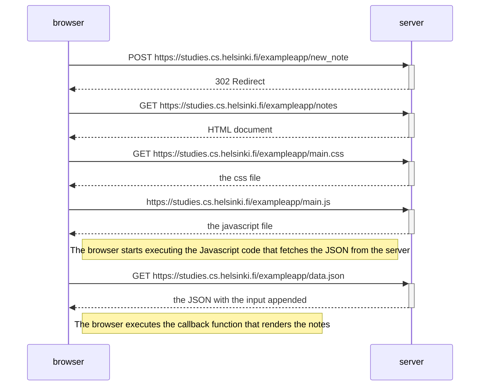

```mermaid
sequenceDiagram
    participant browser
    participant server
    browser ->> +server: POST https://studies.cs.helsinki.fi/exampleapp/new_note
    server -->> -browser: 302 Redirect
    browser ->> +server: GET https://studies.cs.helsinki.fi/exampleapp/notes
    server -->> -browser: HTML document
    browser ->> +server: GET https://studies.cs.helsinki.fi/exampleapp/main.css
    server -->> -browser: the css file
    browser ->> +server: https://studies.cs.helsinki.fi/exampleapp/main.js
    server -->> -browser: the javascript file
    Note right of browser: The browser starts executing the Javascript code that fetches the JSON from the server
    browser ->> +server: GET https://studies.cs.helsinki.fi/exampleapp/data.json
    server -->> -browser: the JSON with the input appended
    Note right of browser: The browser executes the callback function that renders the notes
```